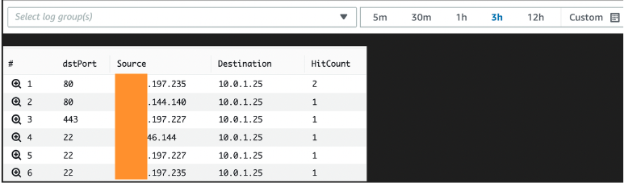

## Quick Start
AWS Cloudwatch Log Insights is a power query tool allowing you to perform complex queries on log events stored in Cloudwatch Log Groups.

This is particularly useful to check legacy applications security group rules are still in use, or can be removed based on factual network traffic analysis.

This example assumes you have configured VPC Flowlogs with CloudWatch Logs as the destination.

In this example a repeatable query can be deployed to analyse VPC Flowlogs to produce a report on a specific elastic network interface and check if configured security group rules are being used. The following ports will be checked in this example.

- 80-http
- 443-https
- 22-ssh
- 25-smtp

### Deploy New Stack
To deploy the Cloudwatch Log Insight query, you simply specify the elastic network interface id of interest and the target prefix for the query to be retrived from in the saved queries list.

```bash
aws cloudformation create-stack \
--stack-name cw-logs-insights-vpc-query \
--template-body file://cw-logs-insights-vpcfl-query.yml \
--parameters ParameterKey=ElasticInterfaceId,ParameterValue=<eni-id> \
ParameterKey=LogGroupName,ParameterValue=vpc-flow-logs
```

### Update Stack
```bash
aws cloudformation update-stack \
--stack-name cw-logs-insights-vpc-query \
--template-body file://cw-logs-insights-vpcfl-query.yml \
--parameters ParameterKey=ElasticInterfaceId,ParameterValue=<eni-id> \
ParameterKey=LogGroupName,ParameterValue=vpc-flow-logs
```

### Delete Stack
```bash
aws cloudformation delete-stack \
--stack-name cw-logs-insights-vpc-query
```

### Resulting CloudWatch Logs Insights Query

In the CloudWatch service > Logs > Logs Insights you will find a saved query by clicking on 'Queries'.


```bash
fields @timestamp,@message
| stats count(*) as HitCountby dstPort, srcAddr as Source, dstAddr as Destination
| filter interfaceId*="<eni-id>"*
| filter dstPort="80"or dstPort="443"or dstPort="22"or dstPort="25"
| sort HitCount desc
```

Specify the log analysis window (3 hours in this example) and click Run. A report will be generated analysing the defined network interface id, checking the destination ports and source IP counts for each port.



This is an easy and effective way to review network security rules which can be removed, increasing the security posture of your AWS hosted applications.

## Security

See [CONTRIBUTING](CONTRIBUTING.md#security-issue-notifications) for more information.

## License

This library is licensed under the MIT-0 License. See the LICENSE file.

